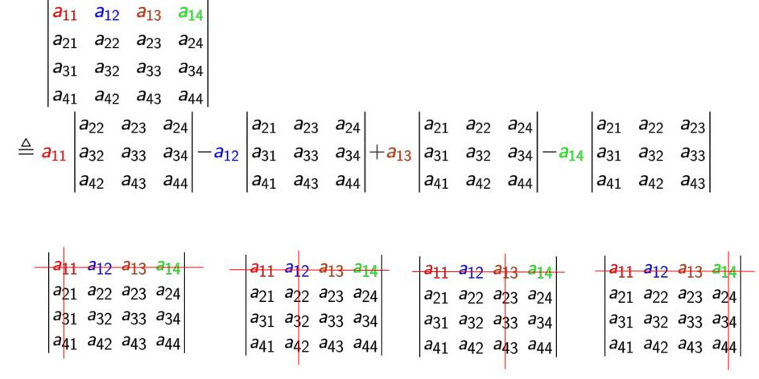

# **Comp. Prog.**
---
# Euclids GCD
---
# Euclids GCD
- Suppose a > b
- gcd(a, b) = gcd(a-b, b)
- gcd(a, b) = gcd(b, a%b)
---
```c
int gcd(int a, int b) {
    int r = a%b;
    if (r==0) {
        return b;
    } else {
        return gcd(b, r);
    }

}

```


---
# Fibonacci with Caching

---
# Problem with Fibonnaci
```c
int rec_fib(int n) {
    if (n==0) {
        return 0;
    } else if (n == 1) {
        return 1;
    } else {
        return rec_fib(n-1) + rec_fib(n-2);
    }
}
```
---
# Problem with Fibonnaci

Function called on same input multiple times.

Each time entire recursion subtree is recomputed!.

---
# Solution: Cache/Store
```
caching_fibonacci(i, cache):
1. If solution for i is in the cache, return solution.
2. Else
   1. Compute fibonnacci for i using recursion
   2. store the solution for i in in cache
```
---
# Compute Determinant of Matrix
---
# Recursive Definition


$$\text{det}(M) = \sum_{i=1}^n (-1)^nM_{1,i}\text{det}(\text{Minor}(M_{1,i})) $$


---
# How to store a matrix?

- 2D array?

```c

int determinant(int M[10][10]) {
    // compute determinant
}

```

---
# How to store a matrix?

- 2D array?

```c

int determinant(int M[10][10]) {
    // compute determinant
}

```

- Prob!: We need to call determinant function on smaller sized matrices. C required dimenions of array to be fixed for a function.

---

# Solution

- Use ``int**`` along with ``int dim`` to represent 2D matrix.
- Use ``malloc``, ``free`` to create and destroy matrices.

---


```c
typedef int** Matrix;

Matrix create_matrix(int dim) {
    Matrix M = malloc(sizeof(int *) * dim); 
    for (int i = 0; i <dim;i++) {
        M[i] = malloc(sizeof(int) * dim);
    }
    return M;
}


void destroy_matrix(Matrix M, int dim) {
    for (int i = 0; i <dim;i++) {
        free(M[i]);
    }
    free(M);
}

int determinant(Matrix M, int dim) {
    Matrix A = create_matrix(dim -1);
    // recursive call on smaller input
    int d = determinant(A, dim - 1);

    destroy_matrix(A, dim - 1); 
}
```
---

# Print all permutations

---
# Representation

```c
typedef int*  Perm;

typedef Perm* PermList;
```
---
# Creation, Destruction, Printing
```c
PermList create_perm_list(int k) {
    int fk = fact(k); 
    // create a PermList, which can hold factorial(k) Perms
    PermList M = malloc(sizeof(Perm) * fk); 
    for (int i = 0; i <fk;i++) {
        M[i] = malloc(sizeof(int) * k);
    }
    return M;
}

void destroy_perm_list(PermList A, int size) {
    for (int i = 0; i <size;i++) {
        free(A[i]);
    }
    free(A);
}

void print_perm(Perm A, int size) {
    for (int i = 0; i < size; i++) {
        printf("%d ", A[i]);
    }
    printf("\n");
}
```
---
# Pseudo code

The function should return the list of all permutations of numbers from 1 .. k.
Pseudo code: perm$(k)$
- Input: $k$
- $M$ := empty list
- $A$ := perm$(k-1)$
- for each permutation $a$ in $A$:  
    - for each position $p$ from $0$ to $k$
        - $p'$ = permutation obtained by inserting $k$ at position $p$ in $a$
        - add $p'$ to $A$
- Base case: if $k = 1$ return list of only $1$ permutation

---
# Code
```c
PermList perm(int k) {
    PermList M = create_perm_list(k);
    if (k==1) { // base case
        M[0][0] = 1;
    } else { // recursive case
        PermList A = perm(k-1); // recursive call
        int t = fact(k-1);
        int c = 0;
        for (int i = 0; i < t; i++) {
            for(int j = 0; j < k; j++) {
                insert_copy_perm(A[i],k-1, j, M[c]);
                c++;
            }
        }
        destroy_perm_list(A, k-1);
    }
    return M;
}
```
---
# Code
```c
void insert_copy_perm(Perm A, int size, int pos, Perm B) {
    for (int i = 0; i <= size; i++) {
        if (i < pos) {
            // same as *(B + i) = *(A + i)
            B[i] = A[i]; 
        } else if ( i == pos) {
            B[i] = size + 1;
        } else {
            B[i] = A[i-1];
        }
    }
}
```


---

# Find shortest path in an $n\times n$ grid.
You are given an $n\times n$ grid. Some cells in the grid contain obstacles. From one cell you are allowed to move to the cell above and cell on the right. Find the shortest path from cell $(1,1)$ to $(n,n)$. 

- Input: $n$ and an $n\times n$ binary matrix with $1$ at the position of obstacles.
- Output: Shortest path from $1\times 1$ to $n\times n$.

---
# Idea 

For each cell $(a,b)$, shortest path from $(1,1)$ passes through $(a-1,b)$ or $(a,b-1)$. Let $c*$ be that cell. Then subpath from $(1,1)$ to $c*$ should also be the shortest path to $c*$.  

---
# Solution Pseudo Code
Input: $(a,b)$
Output: 
- $d_{(a,b)}$ the shortest distance till $(a,b)$ 
- $p_{(a,b)}$ the previous cell in a shortest path.


Alg(a,b):
1. L = $(a-1,b), (a,b-1)$
2. Remove cells from $L$ that have obstructions or goes outside $n\times n$ grid.
3. For each cell c in L
   1. Find $d_{c}, p_{c}$ using Alg(c*)
4. Let $c*$ be the cell with minimum distance in $L$.
5. return $d_{c*} +1, c*$
---
# Isssues!

Algorithm is called on the same input many times. Same computation is happening many times.

Solution: Store (Cache) solutions! See if solution is in the Cache before computing.


---
# Pseudo Code
Alg(a,b, cache):
1. If solution for (a,b) is in the cache, return solution.
2. Else 
   1. L = $(a-1,b), (a,b-1)$
   2. Remove cells from $L$ that have obstructions or goes outside $n\times n$ grid.
   3. For each cell c in L
      1. Find $d_{c}, p_{c}$ using Alg(c*, cache)
   4. Let $c*$ be the cell with minimum distance in $L$.
   5. return $d_{c*} +1, c*$


### Memoization or Dynamic Programming

---
