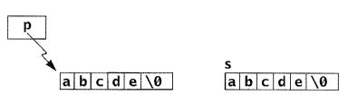

# Enums
```c
typedef enum Weekday {
    Sunday, 
    Monday, 
    Tuesday, 
    Wednesday, 
    Thursday, 
    Friday, 
    Saturday
} Weekday;
```
```c
Weekday today = Wednesday;
printf("Day %d",today+1); 
printf("Size of enum variable = %d bytes", 
        sizeof(today));	
```
---
# Enums : Changing default values
```c
typedef enum Weekday {
    Sunday = 1, 
    Monday, 
    Tuesday, 
    Wednesday, 
    Thursday, 
    Friday, 
    Saturday
} Weekday;
```
```c
Weekday today = Wednesday;
printf("Day %d",today+1);
```
---
# Enums : interchangable with int
```c
typedef enum Weekday {
    Sunday = 1, 
    Monday, 
    Tuesday, 
    Wednesday, 
    Thursday, 
    Friday, 
    Saturday
} Weekday;
```
```c
Weekday today = 100;
printf("Day %d",today+1);
```
---

# Add Payment Mode to Reciept


---

# Payment Mode as `int`


```c
typedef struct Reciept {
    time_t time;
    float value;
    Customer *customer;
    int payment_mode;
} Reciept;
```
---
# Problem

- We have to remember that 
  - `0` is for cash, 
  - `1` is for card, 
  - `2` is for upi
- Code will contain these magic numbers, which might not be obvios to another person.

---
# Enum

```c

typedef enum PayMode {
    Cash = 0,
    Card = 1,
    UPI = 2
} PayMode;

typedef struct Reciept {
    time_t time;
    float value;
    Customer *customer;
    PayMode mode;
} Reciept;
```
---
# Strings in C
- as a pointer to char
```c
char *p = "abcde";
```
- as an array of char
```c
char s[] = "abcde";
```



```c
print("%d %d", sizeof(p), sizeof(s));
```

---
# String Functions

`#include <string.h>`

- `int strlen(char *s)`: returns the length of the string pointed by s (ie lenth upto the first `\0` in memory).
- `char* strcat(char* s1, char* s2)`: concatenates s1 with s2, stores it in s1 and returns s1.
- `int strcmp(char *s1,char *s2)`: returns negative int if s1 is lex. smaller than s2, returns 0 if equal, returns positive int if s1 is lex. greater than s2.
- `char* strcpy(char* s1, char* s2)`: copies s2 in to s1 and returns s1.

---
# Social Network

| Name    | Age | Status        | Friends              |
|---------|-----|---------------|----------------------|
| Alice   | 24  | Single        | Diestel, Eve        |
| Bob     | 28  | Maried        | Alice                |
| Charlie | 20  | Single        | Diestel              |
| Diestel | 27  | Not Mentioned | Alice, Eve, Charlie |
| Eve     | 25  | Engaged       | Diestel, Alice       |

---
# Define a Person (Profile)

```c
enum RelStatus {
    NotMentioned,
    Single,
    Engaged,
    Married
};

struct Person {
    char name[100];
    int age;
    enum RelStatus status;
};
```
### How to define the friends list?
---
# Friends List

```c
struct Person {
    char name[100];
    int age;
    enum RelStatus status;
    int count_friends;
    struct Person friends[5];
};
```
- Will this work?  
- What is the `sizeof(p)` where `p` has type `Person`?


---
# Recursive Type Definition with Pointers

```c
struct Person {
    char name[100];
    int age;
    enum RelStatus status;
    int count_friends;
    struct Person *friends[5];
};
```
---
# How to represent a Social Network?

---
# How to represent a Social Network?

```c
typedef struct SocialNet {
    struct Person members[100];
    int size;
} SocialNet;
```
---
# Build a Social Network

| Name    | Age | Friends              |
|---------|-----|----------------------|
| Alice   | 24  | Diestel, Earl        |
| Bob     | 28  | Alice                |
| Charlie | 20  | Diestel              |
| Diestel | 27  | Alice, Earl, Charlie |
| Earl    | 25  | Diestel, Alice       |

---