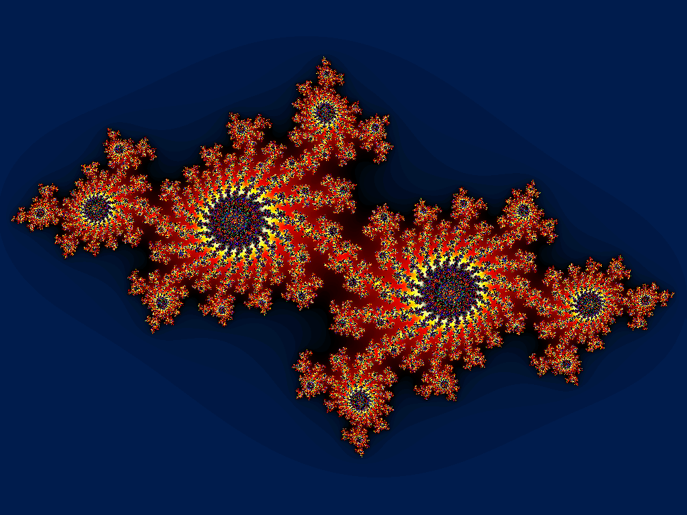

# Comp. Prog.
## lec 36

---
# Header file Issues

---
# Generic Linked List using `void` Pointer

---
# Summary: Part I
- Basic Programming Constructs
  - for/while
  - if/then/else switch/case
  - variables, literals, basic datatypes
  - basic I/O: printf/scanf
- Pointers, Array, Strings
  - pointer arithmetic
  - dynamic memory allocation malloc/free

---
# Summary: Part II
- Recursion
- Abstract Data Types
  - Structs, Struct Array, Struct Pointer, Struct of Struct
  - Recursive structs using pointers     
    (Linked Lists, Social Net)
- File I/O : fgets/fputs fscanf/fprintf fread/fwrite
- Misc
  - Macros
  - Commandline Arguments
  - Multifile Programs
  - C std Libraries (time.h, string.h)

---
# Programs Covered
- Enumerating Permutations using Recursion
- Mergesort using Recursion
- Drawing tree using Recursion
- Store Reciept Management System
- Social Network: 6 degrees of seperation
- Bank Account Management
- Generic Linked Lists
---
# C Features not covered
- Unions and Bitfields
- Function Pointer
- Macros with arguments
---
# Languages/Tools to explore

- Make files
- Git Version Control
- C++ Programming
  - Object Oriented Programming
  - Generic Programing (STL)
- Other Languages
  - Python/Javascript
  - Golang
  - Haskel
  - Swift/Kotlin/C\#

---
# Upcoming Courses
- Datastructures and Algorithms
- Algorithm Design
- Computer Systems Organization
- OS and Compilers
- 

---
# Recursion and Fractals
  

### Some Books 
- Godel, Escher & Bach, David Hofstradter.
- Emperors New Mind, Roger Penrose.

---
# Build a game using allegro

- https://github.com/liballeg/allegro_wiki/wiki/Allegro-Vivace

---
# Margaret Hamilton

Appolo Missions (1960) Softare Architect

https://solarsystem.nasa.gov/people/320/margaret-hamilton/

---

# Thanks and Goodluck!

---