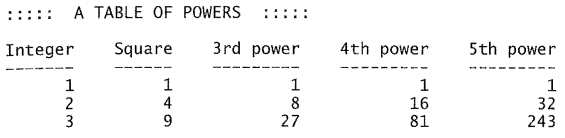

# Comp. Prog.

## Practice Problems


---
### Write a program which neatly prints the table of powers as bellow:



It should take an input $n$, and print the above table upto
$n$ rows.


---
### Write a program which prints all strings

Given input $k$ and $n$, print all strings of length $n$ over
the alphabet $\{0,1,\ldots,k-1\}$.

For $n=2$,$k=2$, it should print
```
00
01
10
11
```

---


### Write a program which prints all strings of matching brackets:

A string consisting of characters '(' ')' is said to be 
matching if the brackets are properly matched. That is
`(())()` is properly matched but `())(()` is not matched. 
Given an even number $n$ as input, print all strings of length
$n$ consisting of characters '(' ')' that are matching.


---

### Write a program which prints all strings of matching brackets with multiple bracket types:

A string consisting of characters '(','[',']', ')' is said to be 
matching if the brackets are properly matched. That is
`[()]` is properly matched but `[(])` is not matched. 
Given an even number $n$ as input, print all strings of length
$n$ consisting of characters '(' ')' that are matching.