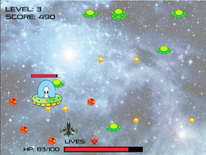

# Game Programming in Allegro
https://liballeg.org/

---
# Allegro

Shooter in 1000 Lines of Code.

---

# Learn it

1. Installation: https://github.com/liballeg/allegro_wiki/wiki/Quickstart

2. Tutorial for building a game: https://github.com/liballeg/allegro_wiki/wiki/Allegro-Vivace
   
3. API Reference: https://liballeg.org/a5docs/trunk/getting_started.html

---
# More examples
- https://github.com/coregameHD/Cavecopter-Lite
- https://github.com/danieldspx/JuggleGame-C
- https://github.com/cpilipis/allegro_asteroids
- https://github.com/tingru0203/Shooter-Game
- https://github.com/rondorkerin/Snake
- Ping Pong: https://liballeg.org/docs/how_to_make_a_pong_game.en.html
- Eg/Demos: https://liballeg.org/examples_demos.html
-  Hello world: https://www.youtube.com/watch?v=9Miq1KpK4ec&list=RDCMUCr-5TdGkKszdbboXXsFZJTQ&start_radio=1&rv=9Miq1KpK4ec&t=29

---

# Project

- Build a game from scratch OR
- Add a feature to a game
- Have to use github, make files, multiple files
- Team of 3/4??
  - Mix good students with weak students?
- Evaluation based on 
  - readability of code, documentation, etc.
  - project execution: How good is the game looking
- Mid Project eval on Jan 16, 17th
- End Project eval on Feb 13, 14th

